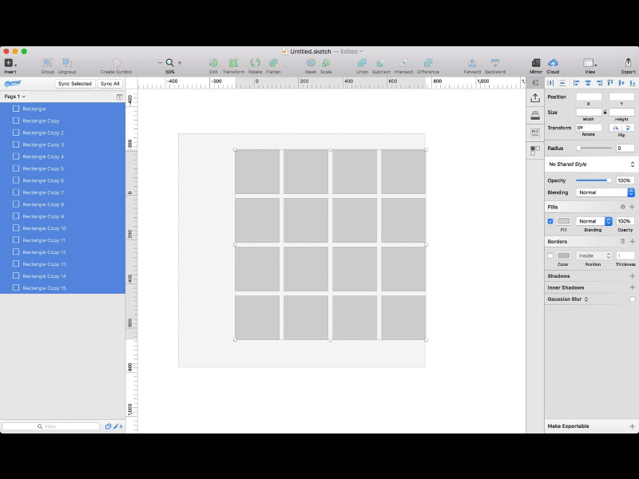

# Sketch Random Avatars
Sketch plugin for loading random avatars from **Random User Api** (https://randomuser.me/)

Credit:
Most of the code I copied from [sketch-content-generator rad faces](https://github.com/timuric/Content-generator-sketch-plugin/blob/master/CG.sketchplugin/Contents/Sketch/Images/Rad%20faces.js) – this is tweaked to take advantage of the massive collection at Random User.

## How it works
When you select layers, and run the script – this will create a request for 10x your selection and randomly select from that response. Ideally you don't get any duplicate images.

